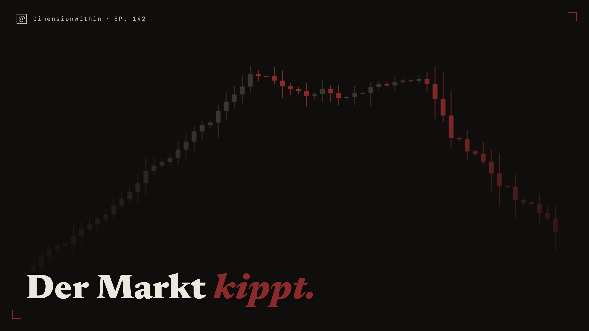
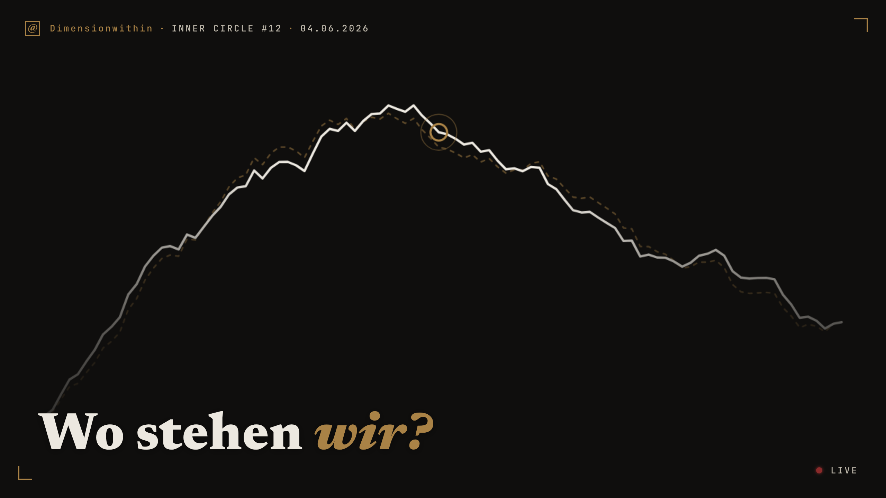

# Thumbnail Agent

Hat den kompletten YouTube-Back-Katalog eines Kanals neu bebildert: Metadaten je Video
auslesen, per Claude-API eine Schlagzeile und eine Markttendenz bestimmen, daraus ein
Thumbnail rendern, alles zur Sichtprüfung vorlegen und erst nach Freigabe hochladen.

**Status: abgeschlossen.** Die Migration war ein einmaliger Vorgang und ist erledigt.

Ein Teil davon läuft weiter: der **Thumbnail-Compositor** wird täglich für neue Videos
genutzt. Er hat unten einen eigenen Abschnitt.

## Was es löst

Ein gewachsener Kanal hat Thumbnails aus mehreren Jahren und in ebenso vielen Stilen.
Von Hand neu zu bebildern heißt: pro Video Titel lesen, Aussage erfassen, Bild bauen,
hochladen — bei einem dreistelligen Katalog Tagesarbeit ohne Erkenntnisgewinn.

Automatisieren allein löst das nicht, denn ein Skript, das massenhaft auf einen Live-Kanal
schreibt, kann in Minuten Schaden anrichten, den niemand rückgängig machen kann. Das
Projekt trennt deshalb sauber: die Maschine schlägt vor, der Mensch entscheidet, und jeder
Schreibvorgang ist vorher gesichert und danach umkehrbar.

## Ergebnis

Zwei mit dem Compositor gerenderte Thumbnails, 2560×1440, direkt aus der Pipeline:

<table>
  <tr>
    <td width="50%"></td>
    <td width="50%"></td>
  </tr>
</table>

## Wie es funktioniert

**Die Migration — vier Stufen, eine Freigabe**

- `youtube/` — OAuth-Desktop-Flow, Inventar des Back-Katalogs. `derive-format` leitet nur
  aus harten Signalen ab (Preset, Episodennummer, Datum), nicht aus Interpretation.
- `decision/` — ein Claude-API-Aufruf je Video bestimmt Schlagzeile und Tendenz
  (bullish / bearish / neutral). Die Tendenz ist fest auf Bildsprache abgebildet:
  bullish → Expansion/Salbeigrün, bearish → Kollaps/Ochsenblut, neutral → Fraktal/Messing.
- `render` — Playwright fährt den Compositor headless und schreibt PNGs.
- `review/` — Kontaktbogen aller Vorschläge als eine HTML-Seite zur Sichtprüfung.
- `publish/` — `backup` → `publish` → `restore`.

**Die Sicherheitslinie — überall dieselbe**

Jede Operation, die den Live-Kanal verändert, hält sich an denselben Satz Regeln:

- Ohne Flag passiert nichts. Der Default ist Dry-Run und gibt nur den Plan aus.
- Echtes Schreiben verlangt `--execute` **und** eine interaktiv getippte Bestätigung.
- Ohne vollständiges Backup kein Publish. Ein Video ohne Backup-Eintrag wird nie
  angefasst; fehlt das Manifest ganz, bricht der Lauf ab.
- Vor jeder Änderung wird der alte Zustand protokolliert — die Aktion bleibt umkehrbar.
- Kleine Batches mit Pause zwischen den Aufrufen (API-Quota) und ein Fortschrittslog:
  nach einem Abbruch werden erledigte Videos übersprungen.

Dieselbe Linie tragen auch die späteren Kanalarbeiten: das Unlisting alter Shorts
(`publish/unlist-shorts.js`, mit CSV-Log und eigenem Restore-Pfad) und der Aufbau der
Livestream-Playlist.

**Mock-Modus**

Die gesamte Pipeline läuft ohne Netzzugang und ohne Zugangsdaten durch: fehlt der
API-Key oder ist `--dry-run` gesetzt, liefern Entscheidungs- und Publish-Schicht
deterministische Beispieldaten. Damit ist der Ablauf prüfbar, bevor er echte Kanaldaten
berührt.

## Der Thumbnail-Compositor

Eine lokale Anwendung aus zwei Teilen: `thumbnail_service.py`, ein Python-Dienst, der
ausschließlich an `127.0.0.1` gebunden ist, und `thumbnail-compositor.html`, die der
Dienst im Browser ausliefert und die das Thumbnail auf einem Canvas zusammensetzt. Wird
weiterhin täglich für neue Videos verwendet, unabhängig von der abgeschlossenen Migration.

- **Nichts verlässt den Rechner.** Der Compositor lädt nichts aus dem Netz: kein CDN,
  kein Webfont-Dienst, keine Bild-URL. Die beiden Schriften (Newsreader, JetBrains Mono)
  liegen als eingebettete WOFF2-Daten in der Datei, die Chartgrafik wird zur Laufzeit
  gezeichnet. Die einzigen Anfragen der Seite gehen an den lokalen Dienst auf
  `127.0.0.1`, der an dieses Interface gebunden ist — es gibt keine Netzwerkanfrage,
  die den Rechner verlässt.
- **Chart-Import aus einem Quellordner.** Der Dienst wählt beim Start und auf Knopfdruck
  den neuesten Screenshot aus dem Quellordner und reicht ihn an den Browser durch. Der
  Quellordner wird ausschließlich gelesen; der Dienst schreibt dort nichts und löscht
  dort nichts.
- **Export in einen festen Zielordner.** Geschrieben wird atomar über eine temporäre
  Datei im Zielordner mit anschließendem Umbenennen, sodass nie eine halbe Datei sichtbar
  wird. Existiert der Name schon, wird kollisionssicher ein neuer vergeben — eine
  bestehende Datei wird nicht überschrieben. Steht der Dienst nicht zur Verfügung, fällt
  der Export auf die File-System-Access-API des Browsers und zuletzt auf einen normalen
  Download zurück.
- **Abgesichert gegen fremde Zugriffe.** Jeder Start erzeugt ein Sitzungstoken, das jede
  Anfrage mitführen muss; dazu kommen Host- und Origin-Prüfung sowie ein Named Mutex, der
  eine zweite Instanz verhindert und stattdessen das bestehende Fenster erneut öffnet.
- **Läuft auch ohne den Dienst.** Dieselbe HTML-Datei funktioniert direkt über `file://`.
  `localService.available` prüft Protokoll, Hostname und Tokenlänge; fällt die Prüfung
  negativ aus, arbeitet der Compositor eigenständig weiter — nur ohne Auto-Import und
  ohne Export in den Zielordner. Genau diesen Weg nutzt `render-harness.cjs` für den
  Automatisierungslauf: Playwright lädt die Datei über `file://` und bricht jede Anfrage
  ab, die nicht `file:`, `data:` oder `blob:` ist. Eine zweite Render-Implementierung gibt
  es nicht — beide Wege gehen durch `window.adwRender(config)`.
- **Ordner konfigurierbar.** Quell- und Zielordner über `--source-dir`/`--export-dir` oder
  die Umgebungsvariablen `THUMBNAIL_SOURCE_DIR`/`THUMBNAIL_EXPORT_DIR`; ohne Angabe
  `./thumbnail-source` und `./thumbnail-export` relativ zum Arbeitsverzeichnis. Start über
  `START-THUMBNAIL-COMPOSITOR.vbs` (ohne Fenster) oder `START-THUMBNAIL-COMPOSITOR.cmd`
  (sichtbar, zur Diagnose).
- **Eine Schnittstelle.** `window.adwRender(config)` liefert das fertige Bild als
  Data-URL zurück. Deshalb ist dieselbe Datei sowohl manuelles Werkzeug im Browser als
  auch Renderer im Automatisierungslauf — es gibt keine zweite Implementierung, die
  auseinanderlaufen könnte.
- **Sechs Presets** (Standard, Inner Circle, Livestream, ohne Chart, AIV, Member Live),
  drei Farbwelten, drei Chartformen, dazu Episodennummer, Datum, Label und automatische
  Titelskalierung.
- **AIV mit fester Emblem-Ebene.** Für die Reihe „Alles ist vorbestimmt" liegt ein
  zweites Bild über dem hochgeladenen: ein Avatar als wiederkehrendes
  Erkennungszeichen. Er wird nicht hochgeladen, sondern steckt als `data:`-URI in der
  HTML — weder der Dienst noch die Render-Harness liefern statische Dateien aus.
  Größe (längere Kante, das Seitenverhältnis bleibt erhalten) und Position sind
  einstellbar; ein schmaler **heller** Schein dahinter hält das Emblem auf hellem wie
  auf dunklem Material lesbar, ohne seine Farbe zu verändern — hell deshalb, weil der
  Avatar fast schwarz ist und seine Kontur auf dunklem Grund sonst verschwindet.
  Anker ist die **untere rechte Ecke**, Standard bündig mit dem unteren Bildrand: das
  Motiv ist unten angeschnitten und liest sich am Bildrand, als schaue es ins Bild
  hinein — frei schwebend würde dieselbe Kante zur Kartenkante. Der Eck-Anker sorgt
  dafür, dass eine Größenänderung die Unterkante bündig lässt, statt das Emblem
  wandern zu lassen. Die **Seite wechselt automatisch**: steht der Titel rechts,
  weicht das Emblem nach links und wird dabei gespiegelt — das bringt die schwere
  Kapuzenmasse zur äußeren Bildkante. Im UI auf links/rechts übersteuerbar. Die
  Reihenfolge ist festgelegt: erst sucht `autoPlace()` die Titelposition, dann
  folgt die Seite, dann höchstens **ein** zweiter Durchgang gegen die verschobene
  Sperrfläche — Seite und Position können einander so nicht im Kreis jagen.
- **Mehrere Emblem-Varianten.** Im Compositor wählbar, gedacht für verschiedene
  Stimmungen. Eine Variante ergänzen heißt: PNG mit Alpha in
  `assets/branding/emblems/` ablegen und `node scripts/embed-aiv-emblem.cjs` laufen
  lassen — kein Manifest, keine Liste im Quelltext. Der Dateiname ohne Endung ist der
  Schlüssel und liefert die Beschriftung im Auswahlfeld. Das Skript prüft dabei Alpha,
  Größe und ob das Motiv an einer Kante angeschnitten ist, die frei sein sollte.
- **Grenze der Auto-Platzierung: helle Fotos.** `autoPlace()` baut eine Belegungskarte
  aus der absoluten Helligkeit (`luma > 0.15` gilt als Inhalt). Bei einem hellen,
  formatfüllenden Foto sind damit praktisch alle Zellen belegt — gemessen 96 % bei
  einem Studioporträt — und die Funktion fällt auf ihren kleinsten Wert
  `bottom @ 50 %` zurück, statt eine freie Zone zu finden. Bei `aiv` berücksichtigt dieser
  Rückfall immerhin die Emblem-Sperrfläche und wählt die Stellung mit der geringsten
  Überdeckung — sonst liefe die Headline durch das Emblem, das genau dort unten rechts
  sitzt. Bei dunklen Charts, wofür
  sie gebaut wurde, funktioniert sie unverändert. Ein Umbau auf lokale Kontrastvarianz
  wäre möglich, wurde aber **bewusst nicht gemacht**: er beträfe alle Presets, während
  das Problem nur bei den wenigen Foto-Formaten im Jahr auftritt — dort ist der Titel
  von Hand schneller gesetzt als das Risiko wert ist.
- `src/config-schema.js` hält den Vertrag zwischen Automatisierung und Renderer:
  validiert, setzt unbekannte Werte auf Defaults zurück und meldet das als Warnung,
  statt still etwas anderes zu zeichnen.

## Der Review-Harvester

Ein zweites, unabhängiges Feature im selben Repo (`src/reviews/`), das die bestehende
YouTube-Authentifizierung mitbenutzt: sammelt positive Kanalkommentare, filtert und
ranked sie, legt sie in einem lokalen HTML-Board zur Kuration vor und exportiert die
freigegebenen als `reviews.json` für die Website. Anonymisierung ist eingebaut — echte
Handles landen nicht im Export. Auch hier kein Auto-Publish: die Datei wird bewusst und
getrennt ausgespielt. Details in [src/reviews/README.md](src/reviews/README.md).

## Technik

- Node.js, CommonJS, keine Build-Stufe
- `@anthropic-ai/sdk` für die Entscheidungsschicht; der System-Prompt trägt die
  Marken- und Stilregeln und ist mit `cache_control` zum Zwischenspeichern markiert,
  damit der stabile Teil über einen ganzen Katalogdurchlauf nicht neu bezahlt wird
- `googleapis` + `google-auth-library` für YouTube Data API v3 (OAuth-Desktop-Flow)
- `playwright` (Chromium, headless) als Render-Antrieb
- Der Compositor ist reines HTML/CSS/JS ohne Framework; der lokale Dienst ist reines
  Python 3 ohne Fremdpakete
- **Teststatus getrennt.** Die Migrationspipeline hat **keine automatisierte Testsuite** —
  es gibt drei einmalige Verifikationsskripte unter `scripts/`, die die
  Sicherheitsgarantien nachweisen (kein Upload ohne `--execute`, Backup-Pflicht,
  Manifest-Pflicht, Wiederaufnahme nach Abbruch). Sie sind nicht Teil der Pipeline und
  laufen nicht in CI. Der **Compositor-Dienst** hat **62 automatisierte Tests** unter
  `unittest`, davon 26 End-to-End über HTTP gegen den laufenden Dienst. Lauf:
  `python tests/test_thumbnail_service.py` aus dem Repo-Root. Ein Test wird ohne
  Symlink-Recht unter Windows übersprungen.
- Keine Typisierung (kein TypeScript, keine JSDoc-Typen)
- Zugangsdaten ausschließlich über `.env`; `.env.example` liegt bei. Tokens und
  Schlüssel sind über `.gitignore` ausgeschlossen und waren nie im Repository.

Quellcode und Kommentare sind auf Deutsch.

## Lizenz

MIT — siehe [LICENSE](LICENSE).

Die in `thumbnail-compositor.html` eingebetteten Schriften stehen unter eigener Lizenz:
Newsreader und JetBrains Mono jeweils unter der SIL Open Font License 1.1. Die MIT-Lizenz
dieses Repositorys gilt für sie nicht.
